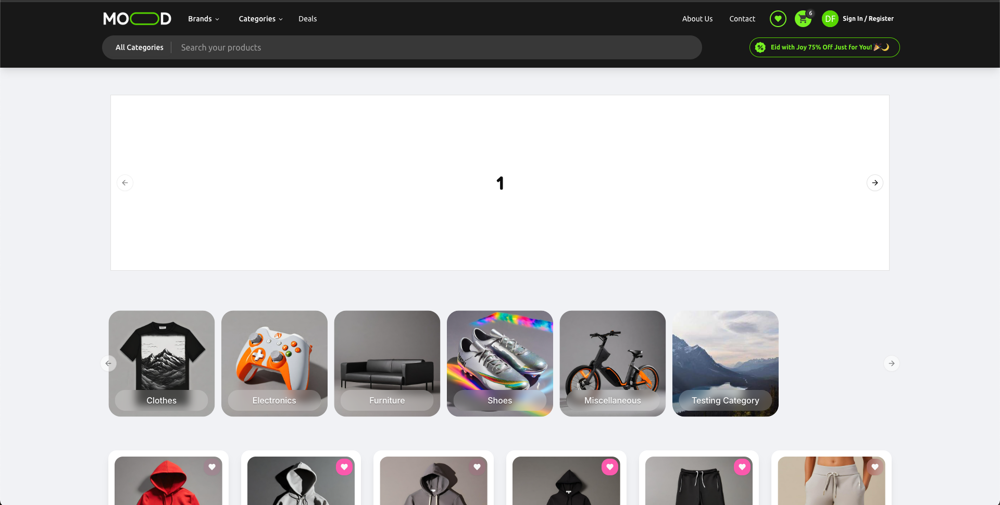
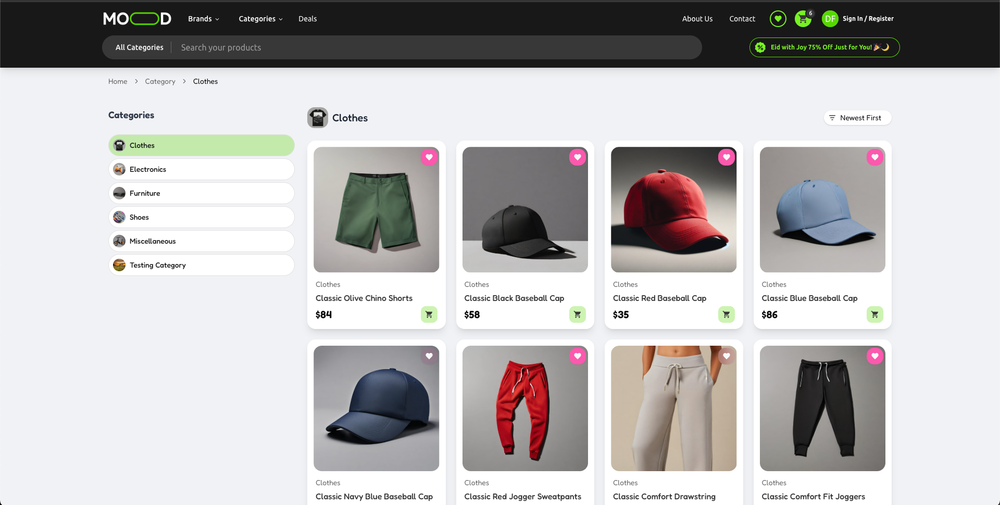
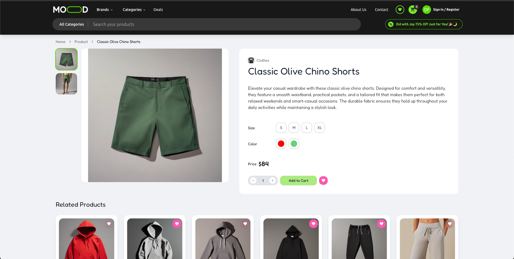
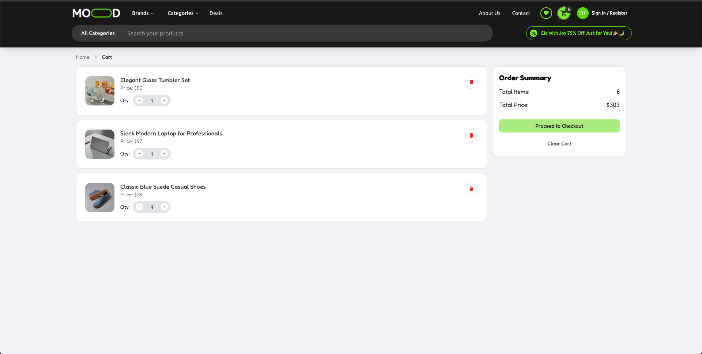

# 🛍️ Vue E-commerce Template

A modern and customizable e-commerce front-end template built with **Vue 3**, **TypeScript**, and **TailwindCSS**. Perfect for developers looking to kickstart an online store project with a clean architecture and scalable design.


---

## 🚀 Features

- ⚡️ Vue 3 Composition API
- 🔐 TypeScript for type safety
- 🎨 TailwindCSS for fast UI styling
- 🛒 Product listing, search, and cart functionality
- ❤️ Favorites / Wishlist support
- 🔍 SEO-ready & responsive design
- 🔧 Component-based structure
- 🧭 Breadcrumb navigation
- 📦 Optimized build with Vite

---

## 📦 Tech Stack

- **Vue 3** + **Vite**
- **TypeScript**
- **TailwindCSS**
- **Pinia** (state management)
- **Vue Router**

---
## 📸 Screenshots

### 🏠 Home Page


### 📄 Product List / Search


### ❤️ Product Detail


### ❤️ Cart Page


## 🧑‍💻 Getting Started

### 1. Clone the repository

```bash
git clone https://github.com/dennyferdiansyah/vue-ecommerce-template.git
cd vue-ecommerce-template
